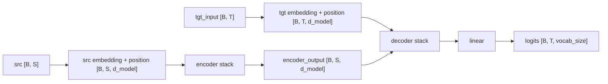

# Transformer From Scratch with PyTorch

Educational encoder-decoder Transformer implementation in PyTorch.

The goal is to learn how the Transformer works internally. This project builds the main pieces by hand instead of using `torch.nn.Transformer`: multi-head attention, feed-forward layers, positional encoding, encoder/decoder layers, masks, training, greedy inference, and checkpoints.

## Project Structure

```text
transformer-from-scratch/
├── check_env.py
├── README.md
├── requirements.txt
├── docs/
│   └── transformer_notes.md
├── src/
│   ├── __init__.py
│   ├── checkpoint.py
│   ├── inference.py
│   ├── model.py
│   ├── overfit_copy_task.py
│   ├── predict_copy.py
│   ├── shape_demo.py
│   ├── train_copy_with_checkpoint.py
│   ├── train_dummy.py
│   └── utils.py
└── tests/
```

Generated checkpoints are written to `checkpoints/` and should not be committed.

## Setup

Create and activate a virtual environment:

```bash
python3 -m venv .venv
source .venv/bin/activate
```

Install dependencies:

```bash
pip install -r requirements.txt
```

## Reserved Token IDs

```text
0 = PAD
1 = SOS
2 = EOS
```

Normal copy-task input tokens should start from `3`.

## Run Environment Check

```bash
python check_env.py
```

This prints the PyTorch version, a random tensor, and the selected device (`mps`, `cuda`, or `cpu`).

## Run Shape Demo

```bash
python src/shape_demo.py
```

The demo walks through the core multi-head attention shapes:

```text
[B, S, d_model]
-> [B, num_heads, S, d_k]
-> scores [B, num_heads, S, S]
-> [B, S, d_model]
```

## Run Component Tests

```bash
python tests/test_mha.py
python tests/test_ffn.py
python tests/test_positional_encoding.py
python tests/test_encoder_layer.py
python tests/test_decoder_layer.py
python tests/test_transformer.py
python tests/test_forward_trace.py
python tests/test_inference_checkpoint.py
```

These scripts print tensor shapes and sanity-check the main components.

## Train Copy Task

Quick random-batch training:

```bash
python src/train_dummy.py
```

Fixed-batch overfit sanity check:

```bash
python src/overfit_copy_task.py
```

The copy task trains examples like:

```text
src: [13, 7, PAD]
tgt: [SOS, 13, 7, EOS, PAD]
```

Training uses teacher forcing:

```python
tgt_input = tgt[:, :-1]
tgt_label = tgt[:, 1:]
```

The loss reshapes logits and labels for `CrossEntropyLoss`:

```python
loss = criterion(
    logits.reshape(-1, vocab_size),
    tgt_label.reshape(-1),
)
```

Padding labels are ignored with:

```python
nn.CrossEntropyLoss(ignore_index=PAD_IDX)
```

## Save Checkpoint

```bash
python src/train_copy_with_checkpoint.py
```

This trains on a fixed copy-task batch, saves:

```text
checkpoints/copy_transformer.pt
```

and reloads it into a fresh model to verify the checkpoint.

## Run Inference From Checkpoint

After training:

```bash
python src/predict_copy.py --src 13 13 7 8
```

Expected behavior:

```text
src tokens:          [13, 13, 7, 8]
decoded copy output: [13, 13, 7, 8]
```

Inference uses greedy autoregressive decoding and stops when EOS is generated.

## Full Command Pipeline

```bash
python check_env.py

python src/shape_demo.py

python tests/test_mha.py
python tests/test_ffn.py
python tests/test_positional_encoding.py
python tests/test_encoder_layer.py
python tests/test_decoder_layer.py
python tests/test_transformer.py
python tests/test_forward_trace.py
python tests/test_inference_checkpoint.py

python src/train_copy_with_checkpoint.py

python src/predict_copy.py --src 13 13 7 8
```

## Tensor Flow



More detailed notes are in [docs/transformer_notes.md](docs/transformer_notes.md).
