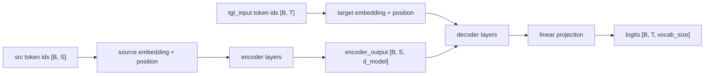

# Transformer Notes

These notes summarize the main ideas in this project. The goal is to connect the code to the tensor shapes you see while running the demos.

## Shape Conventions

| Symbol | Meaning |
| --- | --- |
| `B` | batch size |
| `S` | source sequence length |
| `T` | target sequence length |
| `d_model` | embedding and hidden dimension |
| `num_heads` | number of attention heads |
| `d_k` | dimension per head, `d_model / num_heads` |
| `vocab_size` | number of token ids |

The full model receives token ids:

```text
src: [B, S]
tgt_input: [B, T]
logits: [B, T, vocab_size]
```

## High-Level Architecture



The encoder reads the source sequence. The decoder predicts the next target token while attending to both previous target tokens and the encoded source sequence.

## Multi-Head Attention

Attention uses queries, keys, and values:

```text
Q: [B, num_heads, query_len, d_k]
K: [B, num_heads, key_len, d_k]
V: [B, num_heads, key_len, d_k]
scores: [B, num_heads, query_len, key_len]
```

The steps are:

1. Project input embeddings into Q, K, and V with linear layers.
2. Split `d_model` into `num_heads` smaller vectors of size `d_k`.
3. Compute scaled dot-product attention:

```text
scores = Q @ K^T / sqrt(d_k)
attention_weights = softmax(scores)
context = attention_weights @ V
```

4. Concatenate the heads back to `[B, seq_len, d_model]`.
5. Apply a final output projection.

Multiple heads let the model learn several attention patterns in parallel.

## Feed-Forward Network

The position-wise feed-forward network is:

```text
[B, seq_len, d_model] -> Linear(d_model, d_ff) -> ReLU -> Linear(d_ff, d_model)
```

It is called position-wise because the same MLP is applied independently to every token position. It mixes features inside each token vector, but it does not mix information between different tokens. Token mixing happens in attention.

The expansion `d_model -> d_ff -> d_model` gives the model more capacity while keeping the residual connection shape unchanged.

## Positional Encoding

Self-attention does not know token order by itself. Without position information, the same tokens in a different order can look too similar.

This project uses sinusoidal positional encoding:

```text
pe: [1, max_seq_length, d_model]
x + pe[:, :seq_len, :]
```

The positional encoding is registered as a buffer because it should move with the model to CPU/GPU/MPS and be saved in `state_dict`, but it is not a trainable parameter.

## EncoderLayer

Each encoder layer does:

1. Self-attention over the source sequence.
2. Residual connection and layer normalization.
3. Position-wise feed-forward network.
4. Residual connection and layer normalization.

Source self-attention uses `query = key = value = x`, so every source token can attend to every non-padding source token.

## DecoderLayer

Each decoder layer does:

1. Masked self-attention over target tokens.
2. Cross-attention over the encoder output.
3. Position-wise feed-forward network.

Masked self-attention prevents a target position from seeing future target tokens. Cross-attention lets each target position read from the encoded source sequence:

```text
query: decoder hidden states [B, T, d_model]
key/value: encoder_output [B, S, d_model]
```

This is what supports autoregressive generation: at inference time the decoder predicts one new token, appends it, then predicts the next one.

## Masks

The source padding mask has shape:

```text
src_mask: [B, 1, 1, S]
```

It prevents attention from reading PAD tokens in the source.

The target mask combines padding and look-ahead masking:

```text
tgt_mask: [B, 1, T, T]
```

The padding part hides PAD tokens. The look-ahead part is a lower-triangular matrix so position `t` can only attend to positions `<= t`.

## Teacher Forcing

During training, the full target sequence is shifted:

```python
tgt_input = tgt[:, :-1]
tgt_label = tgt[:, 1:]
```

Example:

```text
tgt:       [SOS, 13, 7, EOS, PAD]
tgt_input: [SOS, 13, 7, EOS]
tgt_label: [13, 7, EOS, PAD]
```

The model sees the correct previous tokens and learns to predict the next token at every position.

## Training

The copy task asks the model to output the same normal tokens it receives:

```text
src: [13, 7, PAD]
tgt: [SOS, 13, 7, EOS, PAD]
```

The model returns:

```text
logits: [B, T, vocab_size]
```

`CrossEntropyLoss` expects class scores as `[N, vocab_size]`, so the training loop reshapes:

```python
loss = criterion(
    logits.reshape(-1, vocab_size),
    tgt_label.reshape(-1),
)
```

Padding labels are ignored:

```python
nn.CrossEntropyLoss(ignore_index=PAD_IDX)
```

## Inference

Greedy decoding starts with `[SOS]`. At each step:

1. Run the decoder on the generated tokens so far.
2. Take the logits at the last position.
3. Choose `argmax` as the next token.
4. Stop early when every sample has generated EOS.

After EOS, later generated positions are treated as PAD.

## Checkpoints

Training saves:

```text
model_state_dict
optimizer_state_dict
step
loss
config
```

The config is important because it records the vocabulary size, hidden size, number of layers, and other values needed to rebuild the same model before loading weights.

Checkpoints should not be committed because they are generated artifacts and can become large. The code and config are the important reproducible parts.
